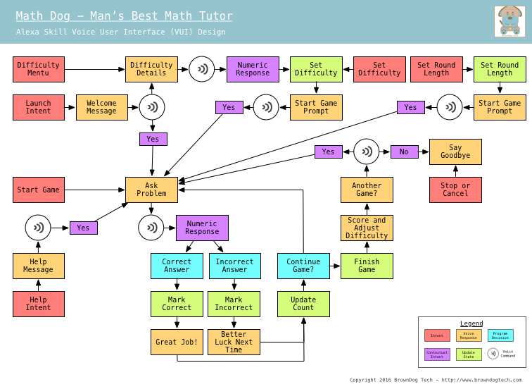

# Alexa Math Dog

This is code and design details for a skill for Amazon Alexa.  This code is designed and built to run in AWS Lambda.

Included files are:

* [math_dog.py](math_dog.py) - Python code to deploy in Lambda
* [math_dog_intent.json](math_dog_intent.json) - Alexa Intent Schema
* [math_dog_utterances.txt](math_dog_utterances.txt) - Alexa Sample Utterances

## Voice User Interface Design

Here is the voice interaction design for Math Dog indicating the intended flow through the application.  Red blocks indicate potential entry points, and arrows follow through the application logic.  Purple blocks are areas where the action taken depends on where in the application the user currently is.  For example, if a user says a number, the program will either consider it an answer to the last asked qeustion, or adjust the difficulty level of the game depending on what was last asked.

## Demonstration Video

Click the link below to view a video of Math Dog in action.

**Link coming soon**
